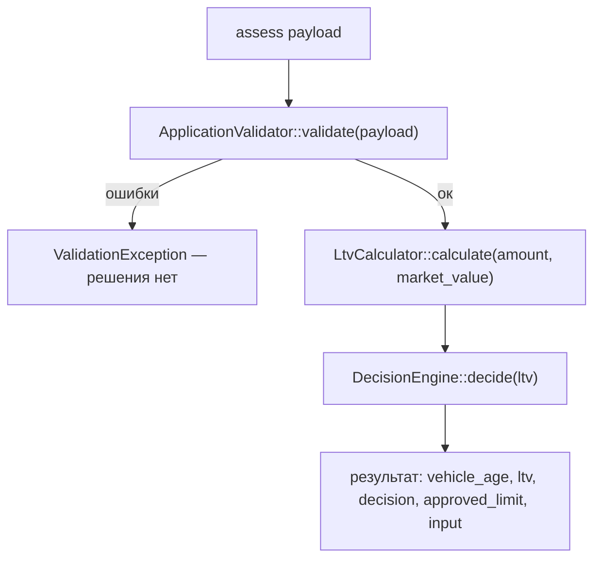

# Карта кода: как считается решение по заявке

Разбор `backend/src/Domain/` и `backend/config/rules.php`: какие файлы участвуют
в предварительной оценке, в каком порядке вызываются, где в решении учитывается
пробег и куда встало бы новое правило «пробег не больше 400 000 км, иначе review».

---

## Участники (файлы)

| Файл | Роль |
|---|---|
| `backend/config/rules.php` | Справочник бизнес-чисел: VIN, параметры авто (год, возраст, пробег), сумма, срок, пороги LTV (`approve_max = 60.0`, `review_max = 85.0`), справочник `ltv_by_age` |
| `src/Domain/AssessmentService.php` | Оркестратор: валидация → LTV → решение → результат |
| `src/Domain/ApplicationValidator.php` (+ `VinValidator`, `VehicleAge`) | Проверка входа; при ошибке бросает `ValidationException` |
| `src/Domain/LtvCalculator.php` | LTV = сумма / стоимость × 100, округление до 2 знаков |
| `src/Domain/DecisionEngine.php` | Единственное место, где появляется `approve` / `review` / `reject` |
| `src/Domain/ValidationException.php` | Носитель ошибок валидации (поле → сообщение) |

## Порядок вызова

Всё начинается с `AssessmentService::assess(array $payload)`:

1. **`ApplicationValidator::validate($payload)`** — по справочнику `rules.php`
   проверяет: VIN через `VinValidator::isValid()` (17 символов, A-Z/0-9,
   без `I O Q`); год через `VehicleAge::inYears()` (не раньше 1990, не из
   будущего, не старше 20 лет); пробег (0…500 000); стоимость > 0; сумму
   (50 000…2 000 000); срок (3…48 мес). Любая ошибка → `ValidationException`,
   до расчёта решения дело не доходит. Успех → нормализованный массив
   `['vin', 'year', 'mileage', 'market_value', 'requested_amount', 'term_months']`.
2. **`LtvCalculator::calculate($input['requested_amount'], $input['market_value'])`** —
   `round(amount / market_value * 100, 2)`; при нулевых аргументах —
   `InvalidArgumentException`.
3. **`DecisionEngine::decide($ltv)`** — единственный вход — LTV (float):
   - `$ltv < approveMax (60.0)` → `approve`
   - `$ltv <= reviewMax (85.0)` → `review`
   - иначе → `reject`

   Нюанс: в коде approve — строгое `< 60`, хотя комментарий в `DecisionEngine`
   и в `rules.php` обещает `LTV <= approve_max`. При LTV ровно 60.0 код вернёт
   `review`.
4. **Результат**: `approved_limit` = запрошенной сумме при `approve`, иначе 0;
   `vehicle_age` считается ещё раз через `VehicleAge`; `input` прокидывается
   в ответ. `ltv_by_age` в решении не участвует (в коде помечено как задача
   LOAN-12, она не сделана).

## Куда встало бы правило «пробег ≤ 400 000 км, иначе review»

Правило меняет **решение**, а не валидность заявки, поэтому место — в цепочке
после валидации, рядом с `DecisionEngine`. Два варианта:

- **Вариант А — `AssessmentService::assess()`** (меньше правок): после строки
  `$decision = $this->decisionEngine->decide($ltv)` добавить проверку: если
  `$input['mileage'] > порога` и решение — `approve`, понизить до `review`.
  Пробег здесь уже доступен.
- **Вариант Б — внутри `DecisionEngine::decide()`** (логичнее по смыслу, там
  сосредоточена вся логика решения), но сигнатуру придётся расширять: сейчас
  `decide(float $ltv)` про пробег ничего не знает.

### Что для правила уже есть

- **Пробег как данные**: `ApplicationValidator` валидирует и нормализует его
  в int; в `assess()` он доступен как `$input['mileage']` (и попадает в ответ
  в `input`).
- **Гарантия корректности**: к моменту решения пробег уже прошёл валидацию,
  то есть он точно в диапазоне 0…500 000.
- **Место для порога**: паттерн «порог в `rules.php`» уже есть
  (`ltv.approve_max`, `vehicle.max_mileage_km`) — новый ключ встал бы,
  например, в секцию `vehicle`.

### Чего не хватает

- **Порога 400 000 в `rules.php`** — нет. Существующий
  `vehicle.max_mileage_km = 500000` — это граница валидации (за ней заявка
  вообще не принимается), а не правило решения; это другое число с другой
  ролью, переиспользовать его нельзя.
- **Доступа к пробегу в `DecisionEngine`** — нет: конструктор принимает
  только пороги LTV, `decide()` — только `float $ltv`. Для варианта Б нужно
  расширить и то, и другое.
- **Механизма комбинирования решений** — нет. В коде решение выводится
  исключительно из LTV, «понижения» решения или сведение нескольких правил
  отсутствуют. Нерешённый вопрос спецификации: что делать, если LTV говорит
  `reject`, а правило пробега — `review` (в коде нет ничего, что это
  определяет; логично брать «худшее», но это решение не зафиксировано).

## Что сейчас проверяется про пробег

- **`ApplicationValidator::validate()`**: пробег приводится к int
  (`$payload['mileage'] ?? -1`) и проверяется на
  `0 <= mileage <= rules['vehicle']['max_mileage_km']` (500 000). Нарушение →
  ошибка «Пробег от 0 до 500 000 км» → `ValidationException`, заявка не
  доходит до расчёта решения.
- **`rules.php`**: ключ `vehicle.max_mileage_km = 500000`.
- Нормализованный пробег прокидывается в `$input` и в поле `input` ответа.

Больше про пробег в коде **нет**: он не участвует ни в расчёте LTV, ни в
`DecisionEngine`, ни в `approved_limit`, ни в `VehicleAge`/`VinValidator`.
Правило «пробег → review» сегодня нигде не реализовано.
